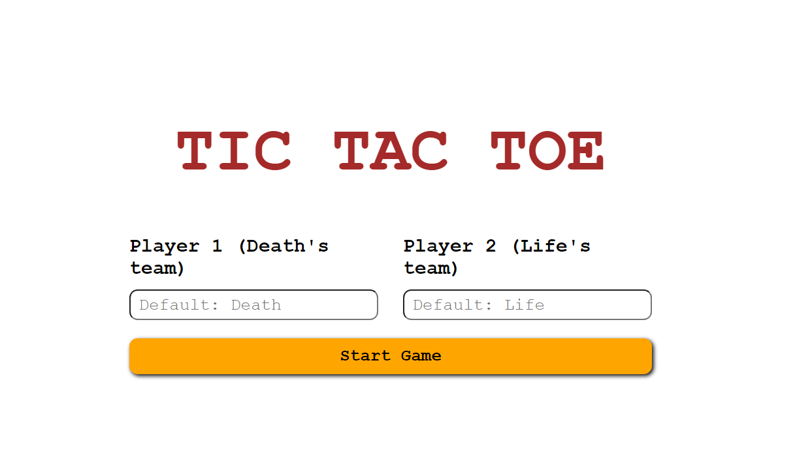
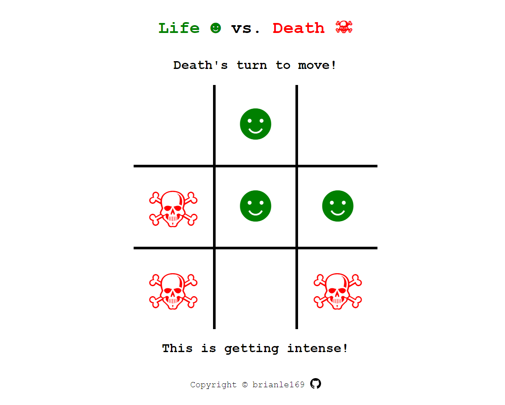
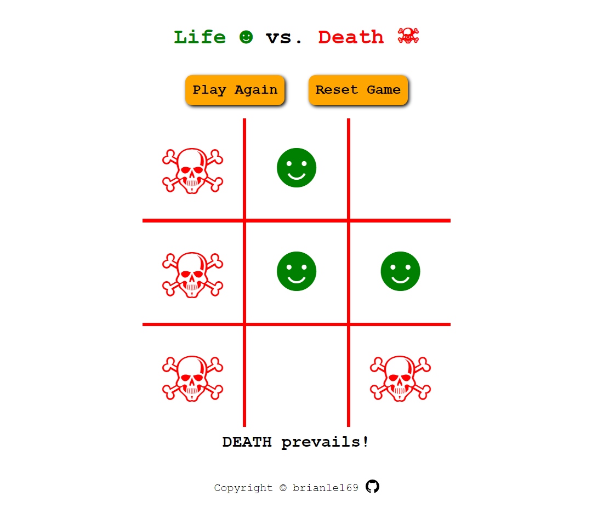
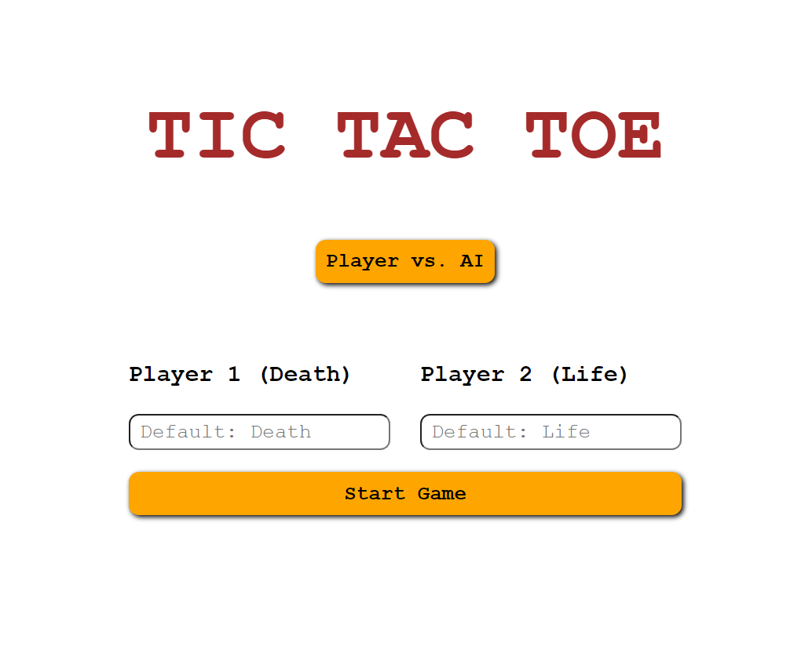

# tic-tac-toe

A web-based, two-player Tic-tac-toe game. With an option for one-player mode.

Instead of the traditional 'X' and 'O' in most tic-tac-toe game. This version took on another style called "Life vs Death". Only the theme is changed, the concept and logic of tic-tac-toe remains the same.

Here are some images of this project.

Start Menu: In this menu, players will input their desired names. If the input fields are left blank, the default names are used as shown in the placeholder.

Game Panel: The main game panel where players will play their moves.

When a player wins, the game panel is displayed something like this:

To test the project, access via [this link](https://brianle169.github.io/tic-tac-toe/)

AI mode is available: This AI uses Minimax Algorithm to recursively calculate the most optimal move for the current game state, assuming that its opponent also plays optimally (it acts as a "maximizing" player, while human players acts as "minimizing" player).

Technically, it is impossible to win against the AI, it will either be lost or tie.

I refered to [this great video](https://www.youtube.com/watch?v=trKjYdBASyQ&t=1234s) by [The Coding Train](https://www.youtube.com/@TheCodingTrain) for the implmentation. Of course the code must be modified to fit my existing code.
